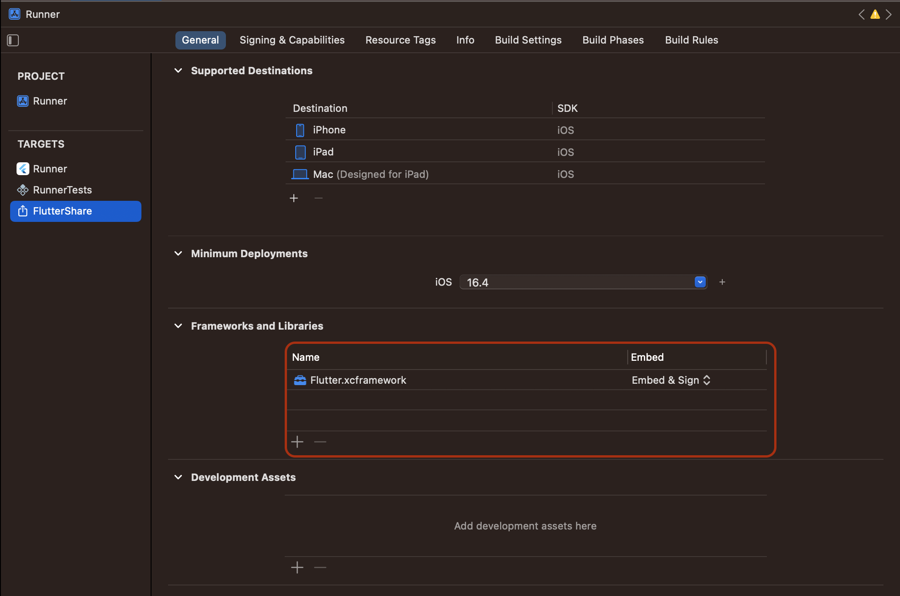
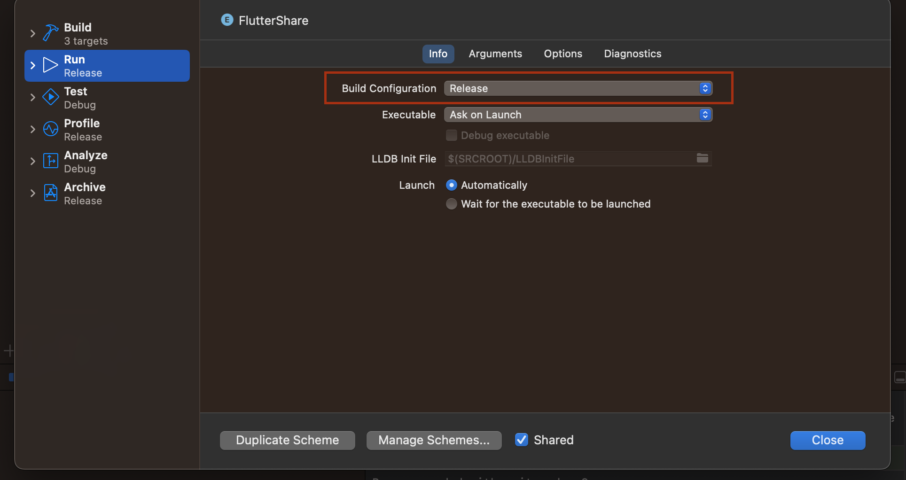

# test_extension

This is an example to test iOS app extension with Flutter.

## Steps to run app extension on iOS devices.

1. Download the artifacts.
    - Build the main app by running `flutter run` on iOS. This step ensures the iOS artifacts are downloaded, including the Flutter.framework for the app extension.

1. Link the share extension target with app extension safe Flutter.framework
    - The Flutter.framework for app extension is located at `path_to_flutter/bin/cache/artifacts/engine/ios`.
    - In XCode, select the FlutterShare target, add the `Flutter.framework` found above in the Frameworks and Libraries section.
    
    - Make sure the FlutterShare target is set to `release` version.
    
        - The debug version of Flutter takes too much of memory that exceeds the memory limit of Share extension. See https://github.com/flutter/flutter/issues/135243

1. Run the FlutterShare target using iOS physical device.
